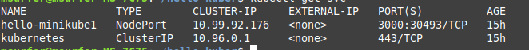
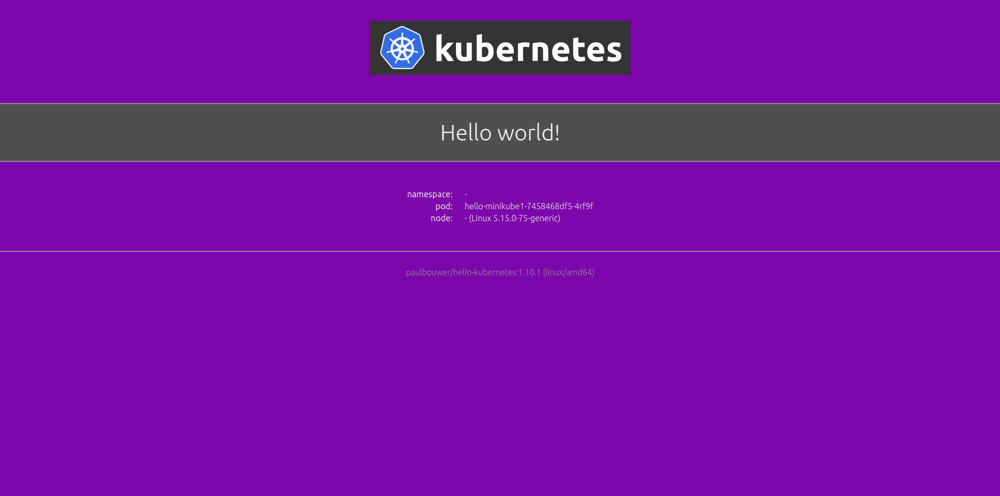
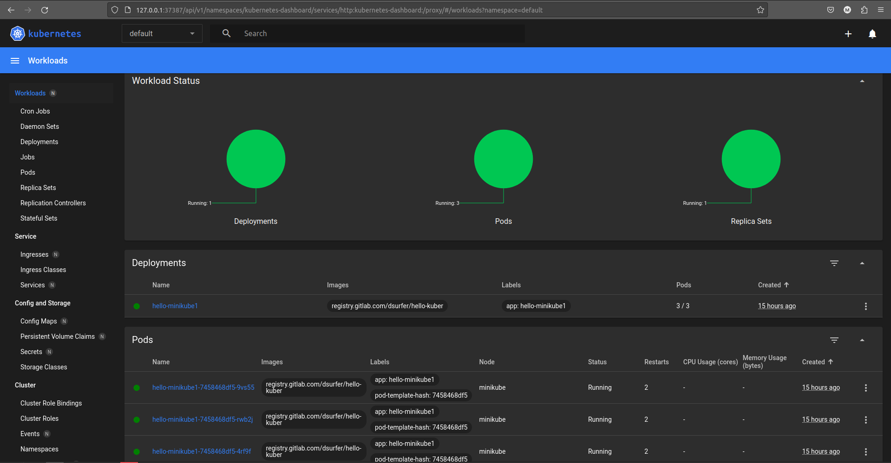

# Измененный проект hello-kubernetes от [Paul Bouwer](https://github.com/paulbouwer/hello-kubernetes)
## Как пользоваться
- Разверните на своей машине [minikube](https://minikube.sigs.k8s.io/docs/start/) любым удобным способом.
- Запустите кластер `minikube start`
- Если не установлен kubectl, то установите его при развернутом кластере minikube командой `minikube kubectl -- get po -A`
- Далее, для запуска приложения в рамках локальной сети, введите команды 
`kubectl create deployment $название_приложения --image=registry.gitlab.com/dsurfer/hello-kuber` 
`kubectl expose deployment $название_приложения --type=NodePort --port=3000`
`kubectl port-forward service/hello-minikube 3000:3000`
- Проверьте, запустилось ли ваше приложение, с помощью команды `kubectl get services $название_приложения`
- Должно выглядеть примерно так 
- Для получения внешнего IP введите команду `minikube service $название_приложения`
- Чтобы развернуть 3 копии вашего приложения введите команду `kubectl scale deployment $название_приложения --replicas=3`
- Откройте ваше приложение с помощью простой команды `minikube service $название_приложения` 
## Опционально
- Введите команду `minikube dashboard`, чтобы в интерактивном интерфейсе увидеть ваше приложение и его реплики 
- Могут возникнуть ошибки, следуйте указаниям из вывода команды.
